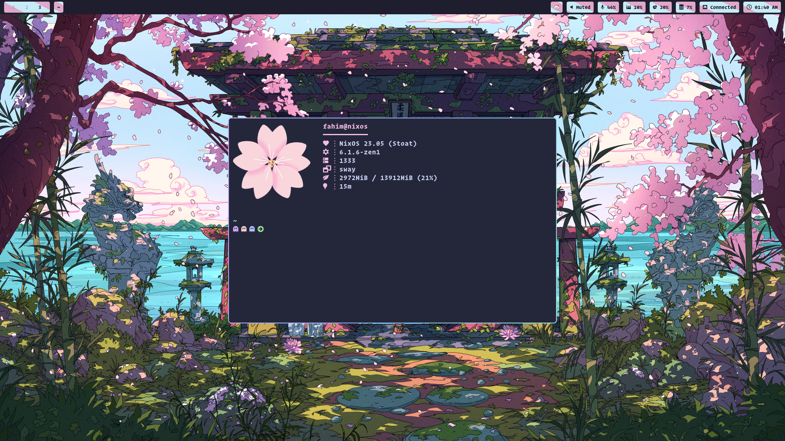
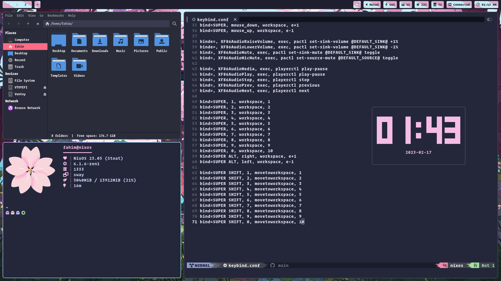

<div align="center">
<br/>
<br/>

# 🌸**Nixos x Hyprland**🌸

  
<br/>
<br/>

# Gallery


<br/>

<br/>



## Video preview


https://user-images.githubusercontent.com/122826532/219851159-1bcfff51-90fa-4084-9e0c-3b8087ef759c.mp4


</video>

</div>

<div align="center">
</br>
</br>

# **Details**

</div>

- **OS**: [Nixos](https://nixos.org/)
- **Window Manager**: [Hyprland](https://github.com/hyprwm/Hyprland)
- **Terminal Emulator**: [kitty](https://github.com/kovidgoyal/kitty)
- **Display Manager**: None `Use shell script for login`
- **Bar**: [Waybar](https://github.com/Alexays/Waybar)
- **Shell**: [Fish](https://github.com/fish-shell/fish-shell)
- **Notifications**: [dunst](https://github.com/dunst-project/dunst)
- **Wallpaper Loader**: [swaybg](https://github.com/swaywm/swaybg)
- **Search menu**: [wofi](https://github.com/uncomfyhalomacro/wofi)
- **Fetch script**: [neofetch](https://github.com/dylanaraps/neofetch)
- **Font**: `Operator Mono, Font-awesome, MesloGs Nf`
- **Wallpaper**: `./modules/hyprland/config/wallpaper.jpg`


<div align="center">

</br>
</br>

# **Installation**
</br>
<span style="color:red;font-size:20px;">Nixos guide</span>
</br>
</br>

</div>


- First clone this repo

```
git clone https://github.com/samiulbasirfahim/nixos.git ~/.config/nixos
```

- Then replace my username by your
- Change fileSystem location
- Then execute this command
```
sudo nixos-rebuild switch --flake ~/.config/nixos/.#nixos
```

- Installtion complete.

<div align="center">
</br>
<span style="color:red;font-size:20px;">Non-nixos guide</span>
</br>
</div>

### First of all create a backup of your old config. Then follow the instruction below.

- Hyprland
```
cp -r ./modules/hyprland/config ~/.config/hypr
```
- Waybar
```
cp -r ./modules/waybar/config ~/.config/waybar
```
- Wofi 
```
cp -r ./modules/wofi/config ~/.config/wofi
```
- Kitty
```
cp -r ./modules/kitty/config ~/.config/kitty
```
- Neovim
```
cp -r ./modules/neovim/config ~/.config/nvim
```
- Fonts  
```
cp -r ./modules/fonts/fonts ~/.local/share/fonts
```
- Themes
```
cp -r ./modules/themes/themes ~/.local/share/themes
```
- Dunst 
```
cp -r ./modules/dunst/config ~/.config/dunst
```


<div align="center">
</br>

# **After installation guide**
<span style="color:red;font-size:20px;">Only for nixos</span>
</br>
</div>

- Now you can just rebuild command in your terminal to `rebuild` your system.
- `sudo` will replace with `doas`.
- Keymappings are in `~/.config/hypr/modules/keybind.conf` file. You can know about them from the conf file.


